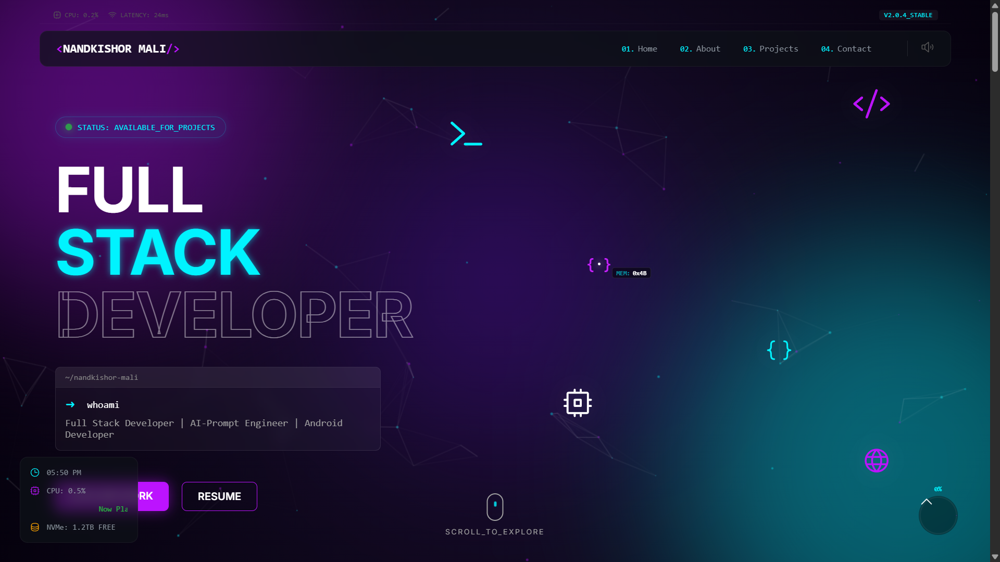

<div align="center">

  # ⚡ Nandkishor Mali | Full Stack Developer
  
  ### _"Building Digital Experiences with Code & Creativity"_

  

  <p align="center">
    <a href="https://reactjs.org/">
      
    </a>
    <a href="https://vitejs.dev/">
      
    </a>
    <a href="https://greensock.com/gsap/">
      
    </a>
    <a href="https://supabase.com/">
      
    </a>
  </p>

  [Live Demo](#) • [Report Bug](#) • [Request Feature](#)
</div>

---

## 🚀 About The Project

Welcome to my personal portfolio v1. This is a **high-performance, interactive** web experience designed to showcase my skills, projects, and journey as a developer. Built with a focus on **immersive UI/UX**, it features a terminal-themed aesthetic, smooth animations, and a seamless 3D feel.

### ✨ Key Features

- **Terminal Aesthetic**: A unique VS Code-inspired theme with terminal commands and syntax highlighting.
- **Immersive Animations**: Powered by **GSAP** (GreenSock), featuring smooth scroll triggers, magnetic buttons, and entrance effects.
- **3D Interactive Elements**: Custom cursor, floating background lights, and particle systems.
- **Projects Intelligence**: A cinematic, horizontal-scrolling project gallery (optimized for desktop) and clean vertical lists (for mobile).
- **Command Palette**: A keyboard-driven (`Cmd/Ctrl + K`) navigation menu for power users.
- **System Dashboard**: Real-time "system" stats (Time, CPU load simulation) for that tech-savvy feel.
- **Responsive Design**: Fully optimized for Mobile, Tablet, and Desktop experiences.

---

## 🛠️ Tech Stack

This project is built using modern web technologies:

| Category | Technology |
|----------|------------|
| **Core** | React 19, JavaScript (ES6+) |
| **Build Tool** | Vite |
| **Styling** | CSS3 (Variables, Glassmorphism, Animations) |
| **Animations** | GSAP (ScrollTrigger), Locomotive Scroll |
| **Database** | Supabase (PostgreSQL) |
| **Icons** | Phosphor Icons |
| **Routing** | React Router DOM |

---

## 📦 Getting Started

Follow these steps to set up the project locally on your machine.

### Prerequisites

- Node.js (v18 or higher)
- npm or yarn

### Installation

1. **Clone the repo**
   ```bash
   git clone https://github.com/yourusername/portfolio.git
   ```

2. **Navigate to the directory**
   ```bash
   cd portfolio
   ```

3. **Install dependencies**
   ```bash
   npm install
   ```

4. **Environment Setup**
   Create a `.env` file in the root directory and add your Supabase credentials:
   ```env
   VITE_SUPABASE_URL=your_supabase_url
   VITE_SUPABASE_ANON_KEY=your_supabase_anon_key
   ```

5. **Start the development server**
   ```bash
   npm run dev
   ```

---

## 📂 Project Structure

```bash
src/
├── components/       # Reusable UI components
│   ├── Hero.jsx      # Main landing section
│   ├── About.jsx     # Developer profile & skills
│   ├── Projects.jsx  # Horizontal scroll project gallery
│   ├── Contact.jsx   # AJAX-powered contact form
│   └── ...
├── pages/            # Page layouts
├── hooks/            # Custom React hooks (useMagnetic, etc.)
├── index.css         # Global styles & variables
└── main.jsx          # Entry point
```

---

## 🎨 UI Highlight: The "Terminal" Theme

The design language mimics a developer's workspace:

- **Preloader**: Simulates a VS Code boot sequence.
- **font-family**: Uses 'Fira Code' for that authentic coding feel.
- **Colors**: Dark mode by default, utilizing a "Neon Cyberpunk" palette (`#00f3ff`, `#bc13fe`).

---

## 🤝 Contact

**Nandkishor Mali** - Full Stack Developer

- **Email**: malinandkishor445@gmail.com
- **LinkedIn**: [linkedin.com/in/nandkishor-mali](https://linkedin.com/in/nandkishor-mali)
- **GitHub**: [github.com/nandkishor-mali](https://github.com/nandkishor-mali)

---

<div align="center">
  <sub>Built with ❤️ and ☕ by Nandkishor</sub>
</div>
